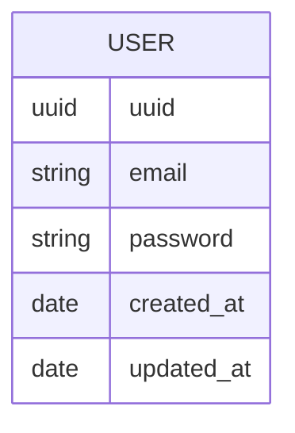

# Dellingr

A simple [NestJS](https://github.com/nestjs/nest) starter repository built using TypeScript.

## Getting Started

### Installation

```bash
yarn install
```

### Building, Running, and Testing the Application

```bash
# Build the application
yarn build

# Lint the application
yarn lint

# Start the application in dev mode
yarn start:dev

# Execute the unit tests for the application
yarn test:unit

# Execute the integration tests for the application
yarn test:integration
```

The project can also be built and started using docker:

> Note: Using docker will start the application in production mode, which excludes database
> fixtures.

```bash
# Build the application using docker
yarn docker:build

# Build and start the application using docker
yarn docker:start

# Attach to the docker logs for the application
yarn docker:logs
```

### Swagger

Swagger documentation is served on [localhost](http://localhost:3000/docs/dellingr/#/). Requests
can be executed directly from the Swagger user interface. The example documentation contains valid
fixtures that are automatically populated on application start-up.

### Database

This package uses TypeORM and PostgreSQL.

#### Migrations

To generate the missing migrations TypeORM applies existing migrations, and uses the diff between
the database schema and the TypeORM entities to create a migration file.

```sh
# Replace <migration-name> with a descriptive name for the generated migration
yarn db:migration:generate:missing <migration-name>
```

#### Structure

The database structure can be seen below (documented using `mermaid.js`):



## Tech Stack

This repository uses:

- [`docker`](https://www.docker.com/products/docker-desktop)
- [`expressjs`](https://expressjs.com)
- [`nestjs`](https://nestjs.com)
- [`typescript`](https://www.typescriptlang.org)
- [`webpack`](https://webpack.js.org/)
- [`yarn2`](https://yarnpkg.com)

### Configuration Files

- `.dockerignore`: ignores the listed files and directories when using the docker COPY command.
- `.eslintignore`: ignores the listed files and directories when running ESLint.
- `.eslintrc.js`: defines the global ESLint configuration.
- `.pnp.cjs`: automatically generated by Yarn2.
- `.prettierignore`: ignores the listed files and directories when running Prettier.
- `.prettierrc`: defines the global Prettier configuration.
- `.yarnrc.yml`: yarn2 configuration.
  - [fix dependencies with package extensions](https://yarnpkg.com/getting-started/migration#fix-dependencies-with-packageextensions)
- `docker-compose.yaml`: defines docker image for local testing
- `jest.config.js`: defines the global Jest configuration which is inherited by each test suite.
- `tsconfig.json`: defines the global TypeScript configuration.
- `webpack-hmr.config.js`: defines the hot module replacement configuration used by webpack.
- `webpack.config.js`: defines the production configuration used by webpack.
- `webpack.util.js`: defines the global Webpack configuration used by each sub `webpack` config.

### Development Tools

- **commitlint**: Enforces the [conventional commit](https://www.conventionalcommits.org/) style.
- **eslint**: JavaScript and TypeScript linter.
- **husky**: Commit hooks that run commitlint, yarn and prettier to ensure quality before pushing.
- **prettier**: Code auto formatter.
- **yarn2**: The preferred package manager.
- **webpack**: The preferred application bundler.
