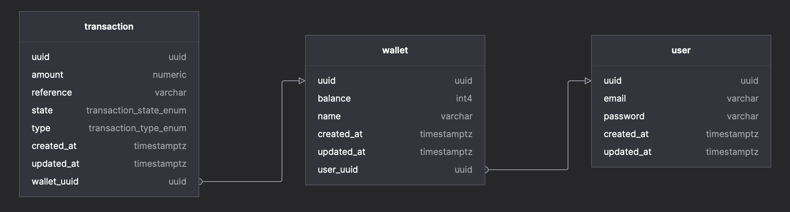

# Dellingr

A simple [NestJS](https://github.com/nestjs/nest) starter repository built using TypeScript.

## Getting Started

### Installation

```bash
yarn install
```

### Building, Running, and Testing the Application

```bash
# Build the application
yarn build

# Lint the application
yarn lint

# Start the application in dev mode
yarn start:dev

# Execute the unit tests for the application
yarn test:unit

# Execute the integration tests for the application
yarn test:integration
```

The project can also be built and started using docker:

> Note: Using docker will start the application in production mode, which excludes database
> fixtures.

```bash
# Build the application using docker
yarn docker:build

# Build and start the application using docker
yarn docker:start

# Attach to the docker logs for the application
yarn docker:logs
```

### Swagger

Swagger documentation is served on [localhost](http://localhost:3000/docs/dellingr/). Requests
can be executed directly from the Swagger user interface. The example documentation contains valid
fixtures that are automatically populated on application start-up.

### Database

This package uses TypeORM and PostgreSQL.



#### Scripts

| script                        | description                                                                       |
| ----------------------------- | --------------------------------------------------------------------------------- |
| db:logs                       | Shows the docker logs of the running PostgreSQL instance.                         |
| db:migration:create           | Creates an empty migration.                                                       |
| db:migration:generate         | Generates a new migration.                                                        |
| db:migration:generate:missing | Generates a new migration by creating a diff.                                     |
| db:seed                       | Seeds the database with predefined fixtures.                                      |
| db:start                      | Starts a PostgreSQL instance in a docker container.                               |
| db:stop                       | Stops and destroys an existing PostgreSQL instance running in a docker container. |

#### Migrations

To generate the missing migrations TypeORM applies existing migrations, and uses the diff between
the database schema and the TypeORM entities to create a migration file.

```sh
# Replace <migration-name> with a descriptive name for the generated migration
yarn db:migration:generate:missing <migration-name>
```

## Structure

The section provides insight into how the project has been structured.

### Source Code

The source code directory has been structured in a very flat manner, all directories are `modules`
except for the `common` and `db` directories.

- The `common` directory contains everything that is
  not a module. These classes may be re-used throughout the application without any restrictions.
- The `db` directory encapsulates all database related functionality (more on this below).
- Each `module` consists of a presentation layer in the form of an HTTP `controller`, and domain /
  business logic that has been wrapped in a `service` not all `modules` need to provide a
  `controller`, e.g. the `token` module only has a `service` implementation that is imported by
  other application `modules`.

```sh
src
├── app
├── auth
├── common
│   ├── config
│   ├── constants
│   ├── dto
│   │   ├── req
│   │   └── res
│   ├── enum
│   ├── error
│   ├── filters
│   ├── guards
│   ├── pipes
│   ├── swagger
│   └── validators
├── db
│   ├── entities
│   ├── fixtures
│   ├── migrations
│   ├── repositories
│   │   ├── aggregate
│   │   └── entity
│   └── utils
├── health
├── token
├── transaction
├── user
└── wallet
```

### Repositories

The repositories have been divided into the following groups:

Private:

- `aggregate`: These repositories `aggregate` / `join` multiple entities together.
- `entities`: These repositories only operate on a single `entity`.

Public:

- `root`: The `root` / `compositional` repositories compose multiple `aggregate` or `entity`
  repositories together, and expose the functionality to `services`.

This structure ensures that a single repository class is **ONLY** responsible for operating within a
specific `entity` scope. The `root` / `compositional` repositories adhere to an interface defined
in the `types/api/index.d.ts` file. All entities also extend interfaces declared in the this file,
this assists in ensuring that the database layer is completely encapsulated from the rest of the
source code. A database `entity` **MUST** never be directly referenced outside of the `db` directory
within the source code.

All `root` / `compositional` repositories are exported by the `repository.module`. A `service` is
permitted to use on or more `repositories`. A repository must **NEVER** contain business logic. The
ability of a `service` to use multiple `repositories` via a single module import greatly reduces the
risk of creating circular dependency issues between `services`.

```sh
src/db/repositories
├── aggregate
│   ├── aggregate.module.ts
│   ├── transaction-wallet-user.repository.ts
│   ├── user-wallet-transaction.repository.ts
│   ├── user-wallet.repository.ts
│   └── wallet-transaction.repository.ts
├── entity
│   ├── entity.module.ts
│   ├── transaction-entity.repository.ts
│   ├── user-entity.repository.ts
│   └── wallet-entity.repository.ts
├── index.ts
├── repository.module.ts
├── transaction.repository.ts
├── user.repository.ts
└── wallet.repository.ts
```

### Testing

The tests are divided into `integration` and `unit` tests. The `unit` test directory mimics the
layout of the source code. The `integration` test directory has a flat structure and is only
concerned with performing end-to-end tests on exposed endpoints.

The `utils` directory contains test helper functions, `fixtures`, and `mocks`.

```sh
test
├── integration
│   ├── jest.config.js
│   ├── setup.ts
│   └── specs
│       ├── auth.module.spec.ts
│       ├── health.module.spec.ts
│       ├── transaction.module.spec.ts
│       ├── user.module.spec.ts
│       └── wallet.module.spec.ts
├── unit
│   ├── jest.config.js
│   ├── setup.ts
│   └── specs
│       ├── auth
│       │   ├── auth.controller.spec.ts
│       │   └── auth.service.spec.ts
│       ├── common
│       │   ├── config
│       │   │   └── helmet.config.spec.ts
│       │   ├── filters
│       │   │   └── error.filter.spec.ts
│       │   ├── guards
│       │   │   └── jwt-auth.guard.spec.ts
│       │   ├── pipes
│       │   │   └── dto-validation.pipe.spec.ts
│       │   └── validators
│       │       └── is-valid-password.validator.spec.ts
│       ├── health
│       │   └── health.controller.spec.ts
│       ├── token
│       │   └── token.service.spec.ts
│       ├── transaction
│       │   ├── transaction.controller.spec.ts
│       │   └── transaction.service.spec.ts
│       ├── user
│       │   ├── user.controller.spec.ts
│       │   └── user.service.spec.ts
│       └── wallet
│           ├── wallet.controller.spec.ts
│           └── wallet.service.spec.ts
└── utils
    ├── fixtures
    │   └── index.ts
    ├── integration
    │   ├── auth.util.ts
    │   ├── no-output.logger.ts
    │   └── setup-application.ts
    └── mocks
        ├── repo.mock.ts
        └── service.mock.ts
```

## Tech Stack

This repository uses:

- [`docker`](https://www.docker.com/products/docker-desktop)
- [`expressjs`](https://expressjs.com)
- [`nestjs`](https://nestjs.com)
- [`typescript`](https://www.typescriptlang.org)
- [`webpack`](https://webpack.js.org/)
- [`yarn2`](https://yarnpkg.com)

### Configuration Files

- `.dockerignore`: ignores the listed files and directories when using the docker COPY command.
- `.eslintignore`: ignores the listed files and directories when running ESLint.
- `.eslintrc.js`: defines the global ESLint configuration.
- `.pnp.cjs`: automatically generated by Yarn2.
- `.prettierignore`: ignores the listed files and directories when running Prettier.
- `.prettierrc`: defines the global Prettier configuration.
- `.yarnrc.yml`: yarn2 configuration.
  - [fix dependencies with package extensions](https://yarnpkg.com/getting-started/migration#fix-dependencies-with-packageextensions)
- `docker-compose.yaml`: defines docker image for local testing
- `jest.config.js`: defines the global Jest configuration which is inherited by each test suite.
- `tsconfig.json`: defines the global TypeScript configuration.
- `webpack-dts.config.js`: defines the type generation configuration used by webpack.
- `webpack-hmr.config.js`: defines the hot module replacement configuration used by webpack.
- `webpack.config.js`: defines the production configuration used by webpack.
- `webpack.util.js`: defines the global Webpack configuration used by each sub `webpack` config.

### Development Tools

- **commitlint**: Enforces the [conventional commit](https://www.conventionalcommits.org/) style.
- **eslint**: JavaScript and TypeScript linter.
- **husky**: Commit hooks that run commitlint, yarn and prettier to ensure quality before pushing.
- **prettier**: Code auto formatter.
- **yarn2**: The preferred package manager.
- **webpack**: The preferred application bundler.
